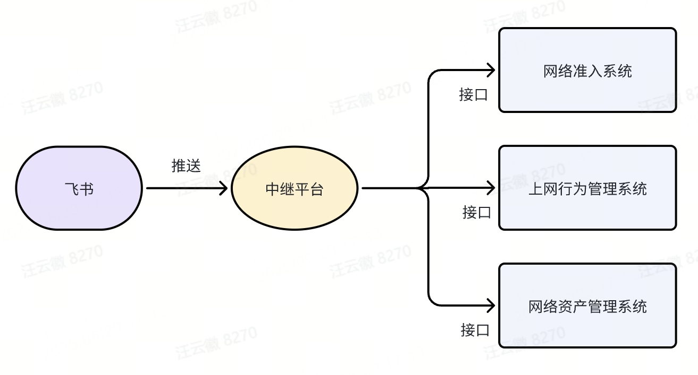
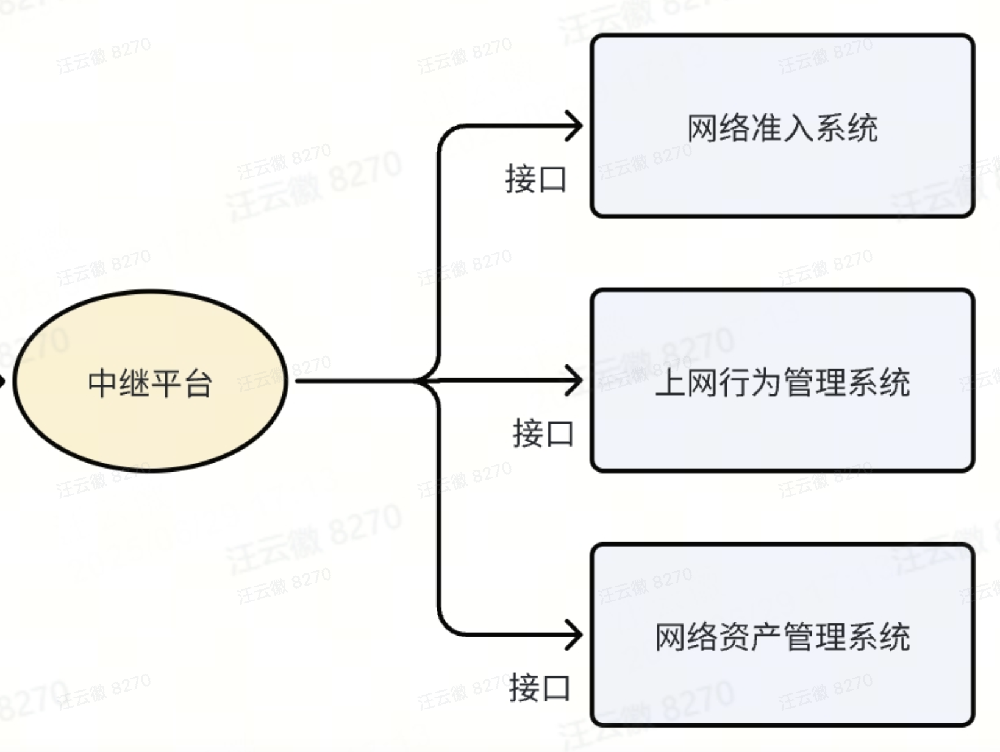

# 浅谈企业IT信息系统交互


在企业信息系统建设中，采用多种不同供应商的信息系统是很常见的事情。通常它们各司其职，但“打通壁垒”才能更好地在整个企业中起到高效支撑的作用。

以笔者的工作为例，网络管理员一般会有常见的重复工作，比如：

* 新员工入职，设备添加网络白名单
* 员工上网权限变更，放行/关闭策略
* 上架或下架设备后需要变更设备状态

这些工作有以下共同点：

都有对应的流程、分散在不同的网络管理系统中，重复性强而且操作较为固定，价值不高。

那么有没有办法从这些**手动重复操作**中解放出来呢？答案是有的：


## 用中继平台打通信息系统接口

有读者可能会有疑问：接口就是用来通信的，为什么还需要一个中继平台？主要是以下几点原因。

* 接口格式不统一，需要进行中间处理
* 个性化需求要厂商开发介入改造，反馈周期长、有花费
* 多个信息系统通信很麻烦，中继平台可以在中间转发，支持复杂处理逻辑

现在回到笔者最初的例子中，把中继平台和信息系统接口放到该场景下，是什么样的方案呢？



如图，飞书上的流程（入网申请、策略变更、资产状态变更）结束审批后，推送事件到中继平台；中继平台调用对应系统的接口进行数据状态变更（增删改查等）。这样一来，原本需要手工进行的加白名单、策略变更、状态变化工作就可以通过API接口来自动进行了。

**中继平台作为一个“中心”，连通了办公软件和各个信息系统。**

具体来说，飞书推送的事件中，会包含用户的信息（比如入网的地址，变更的权限名称，资产编号等），中继平台**封装**成其他系统的API格式就可以发出修改了。

既然中继平台这么重要，我们通过什么方式实现它呢？笔者这里分享一种基于Django的方案。


## Django框架构建中继平台

⚠️注：由于中继平台高度定制化，所以需要企业或部门具备一定开发能力；

为什么用Django：

* 纯接口中继开发工作量较小，单人可以胜任
* 成熟的企业级框架（jumpserver、netbox等商业化软件都基于Django）
* 平台化建设开发，前端扩展性强

Django部署和基本教程网上有很多，今天主要介绍中继平台的接口相关部分：

总体来说，一句话概括就是：

```
办公软件推事件，中继平台接收处理，然后调用信息系统API进行增删改查。
```


### 1 办公软件：推送事件（Webhook）

像前文提到的，当办公软件中发生某些特定事件（如审批结束、用户注册、字段状态变更等），此应用会将这个事件的信息以HTTP请求的形式发送给预先设置好的一个URL，这样的通信机制就是**Webhook**。


办公软件**推送事件**的能力一般是内置的，可以查询厂商的相关文档：例如致远OA的接口文档：[流程事件 · 致远开放平台](https://open.seeyon.com/book/ctp/bpmEvent.html#流程事件接口)；飞书则是有对应的平台，几乎可以做到一键配置：[将事件发送至开发者服务器 - 服务端 API - 开发文档 - 飞书开放平台](https://open.feishu.cn/document/event-subscription-guide/event-subscriptions/event-subscription-configure-/choose-a-subscription-mode/send-notifications-to-developers-server) ；也可以咨询他们的开发人员。

那么第一步只需配置办公平台的Webhook地址：即Django中继平台的服务器地址+监听URL。

```
http://django_server_ip:port/api/event
```

（笔者的示例URL）

### 2 中继平台：监听 & 接收事件（APIView）

刚刚笔者在办公平台配置了webhook推送地址，现在第二步：

在 Django 中，使用 `APIView` 类来监听发送到`django_server_ip:port/api/event` 的事件。

#### 1）定义 `APIView` 类
首先，在 `api/views.py` 文件中定义一个继承自 `APIView` 的类。在这个类中通过定义 `get`、`post` 方法来处理不同的 HTTP 请求。

```python
from rest_framework.views import APIView
from rest_framework.response import Response
from rest_framework import status

class FeishuEventWebhook(APIView):
		# 当外部系统触发事件时，飞书会通过HTTP POST请求将事件数据发送到预先配置的Webhook地址
    def post(self, request, *args, **kwargs):
        # 处理 POST 请求
        data = {"message": "Hello, this is a POST request"}
        # 处理飞书event数据
        
        # 调用对应API接口
        return Response(data, status=status.HTTP_200_OK)
```

#### 2）配置 URL
在 `api/urls.py` 文件中将视图类与一个 URL 关联起来。

```python
from django.urls import path
from .views import FeishuEventWebhook

urlpatterns = [
    path('event/', FeishuEventWebhook.as_view()),
]
```

这样就实现了中继平台监听事件URL的搭建。


### 3 信息系统：被调用 & 增删改查

到了这一步基本已经完成了所有工作，只需要在上一部分提到的 `FeishuEventWebhook` 类的Post方法中**按照情况调用不同系统的API**脚本即可。



出于代码封装和功能解耦的原则，可以在django项目目录下单独创建一个文件夹（scripts）存放各个系统的API脚本：

```
django_project_file/scripts/...
```

* System1_api.py
* System2_api.py
* System3_api.py

这里以新华三H3C的云简平台API为例进行举例介绍：

```python

import requests
import logging
from datetime import datetime


class H3COasisAPI:
    """
    H3C Oasis API 接口类提供与H3C Oasis平台交互的接口方法，包括设备信息查询和流量统计等功能。
		"""

    def __init__(self):
        # 定义API配置信息
        self.shop_id = ""  # 替换为实际的场所ID
        self.api_key = ""  # 替换为实际的API密钥
        self.devSN = ""
        self.device_api_url = ""
        self.basic_api_url = ""
        self.flow_api_url = ""

        # 定义请求头
        self.headers = {
            "Content-Type": "application/json",
            "apikey": self.api_key
        }

    def _make_request(self, url, body, error_msg_prefix="请求失败"):
        """
        通用请求处理方法

        Args:
            url (str): API端点URL
            body (dict): 请求体数据
            error_msg_prefix (str): 错误消息前缀

        Returns:
            dict: API响应数据，失败时返回None
        """

    def get_flow_statistics(self, user, start_time, end_time):
        """
        获取流量统计信息

        Args:
            user (str): 用户名（MAC地址）
            start_time (int): 开始时间戳（毫秒）
            end_time (int): 结束时间戳（毫秒）

        Returns:
            dict: 流量统计信息
        """
```

一旦API脚本完成了，就在一直等待被调用完成对应的增删改查工作。


## 总结 & 泛化


今天谈到的问题其实并不局限于**飞书和网络管理系统**，站在企业的角度，可能会有各种各样的办公系统（**OA，IM即时通讯**），也肯定会有各种各样的**信息系统**。通过搭建中继平台，可以作为企业信息系统的“桥梁”，更好支撑企业现代化、数字化转型。
