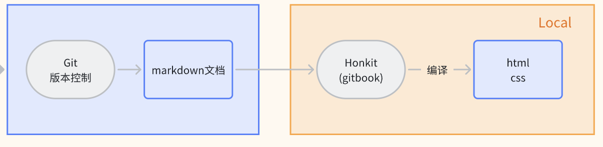
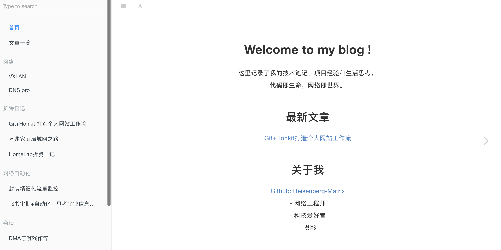
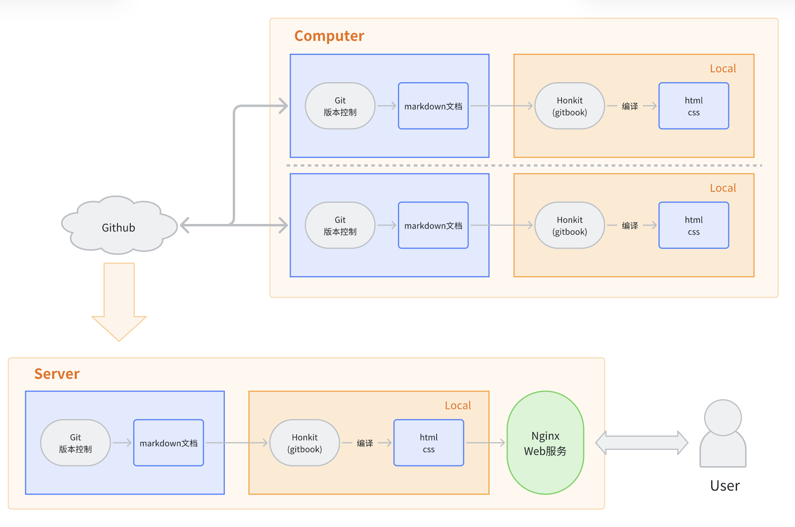

# Git+Honkit 打造个人网站工作流

## 目录

* 为什么用Honkit
* 架构图
* 备份方案
* Honkit安装过程

<br>分享一个最近部署的个人网站工作流搭建方案：



用Git做版本控制，markdown文档做内容，部署Honkit（gitbook停止维护后的分支框架）编译html文件+本地静态展示。

同时，Git仓库上传云端后，可以在不同设备间无缝切换工作流，只需要在工作开始/结束时进行pull和push操作。

另外，云服务器的价格现在很让人震惊，笔者在两个大厂商买了一年时长的轻量级服务器各自都才两位数人民币（为了公网IPv4地址。国内运营商最近政策收紧强推IPv6，个人用户不好拿v4地址了）。


## 为什么用Honkit



* 注重内容本身
* 简洁美丽的框架
* 快速部署上手，轻量级应用
* 灵活性高：全平台 & 支持css自定义扩展外观


## 架构图




## 备份方案

后续准备把网站建设成一个工作Notes的集合，因此数据的备份容灾非常重要。git本地仓库 + 云端Github的方式本身就具有一定的容灾性，考虑到云服务的主动权不在用户本身，可以在本地NAS和Server定期git pull --force主分支来做2份本地磁盘保存。（给Homelab的建设的文章挖坑。）

***

## Honkit安装过程

### 1.安装Node.js

Windows和mac平台：

- 访问 [Node.js 官网](https://nodejs.org/)，下载并安装 LTS 版本的 Node.js。
- 安装完成后，打开命令提示符，输入以下命令验证安装是否成功

```bash
node -v
npm -v
```

Linux平台：


### 2.安装Honkit

- 进入项目目录

- 初始化 npm 项目：

  ```bash
  npm init --yes
  ```

- 安装 HonKit：

  ```bash
  npm install honkit --save-dev
  ```

### 3.**创建和初始化 HonKit 项目**

运行以下命令初始化 HonKit 项目：

```bash
npx honkit init
```

编译项目文件：

```bash
npx honkit build
```

启动本地预览服务器：

```bash
npx honkit serve
```

默认情况下，书籍会在 [http://localhost:4000](http://localhost:4000/) 上运行。


<br>

感谢看到这里的你，愿科技改变生活。欢迎等待后续更新！

Last update: 2025-06


